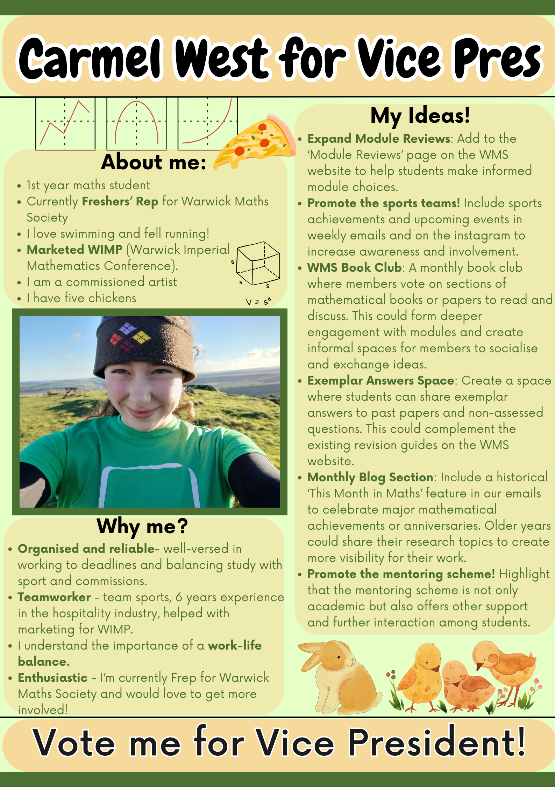
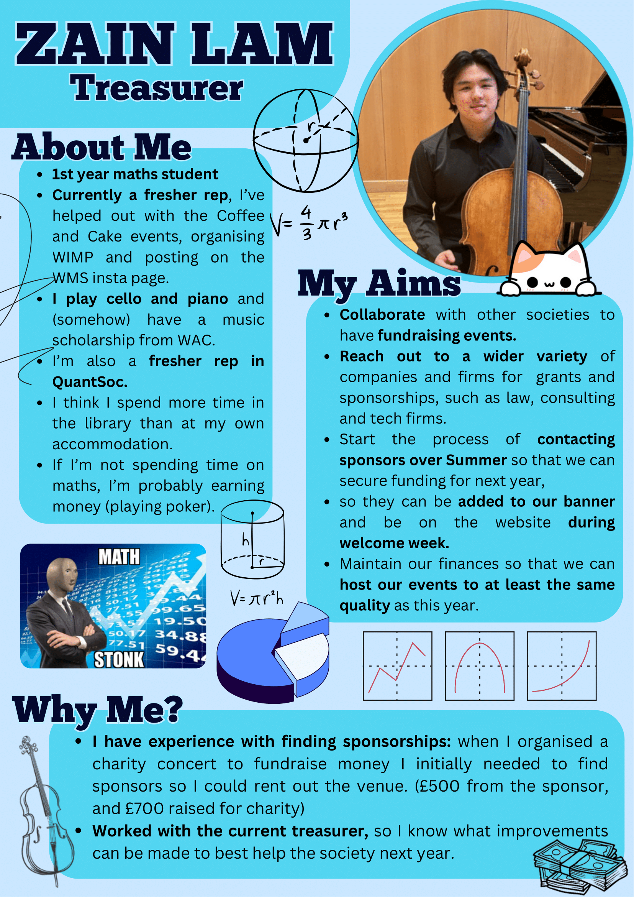
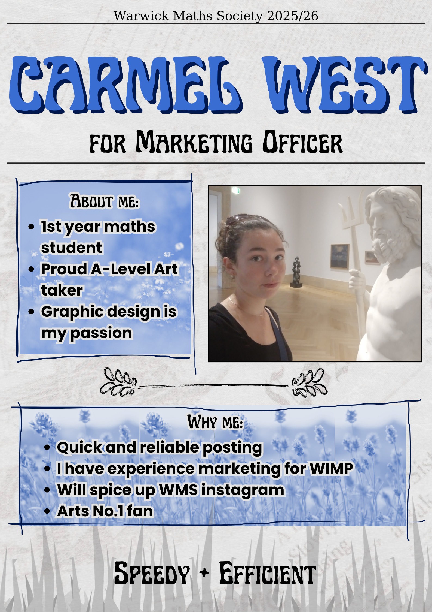

This page lists the manifestos for the candidates in the upcoming elections as part of the **AGM** on **Thursday (6th)** in **MS.03** from **1800**.

### President
##### Ingrid Loynes

[PDF download](<../assets/posts/2024-2025/AGM-manifestos/Ingrid_Loynes_president.pdf>)

### Vice President
##### Ekaterina Leksina

##### Carmel West

### Treasurer
##### Zain Lam

[PDF download](<../assets/posts/2024-2025/AGM-manifestos/Zain_Lam_treasurer.pdf>)

##### Val

[PDF download](<../assets/posts/2024-2025/AGM-manifestos/Val_treasurer.pdf>)

### Welfare and Equal Opportunities Officer
##### Dori

[PDF download](<../assets/posts/2024-2025/AGM-manifestos/Dori_welfare.pdf>)

##### Charlotte Hegarty

[PDF download](<../assets/posts/2024-2025/AGM-manifestos/Charlotte_Hegarty_welfare.pdf>)

##### Deeya Sharma

[PDF download](<../assets/posts/2024-2025/AGM-manifestos/Deeya_Sharma_welfare.pdf>)

### Social Secretary
##### Will and Kai

[PDF download](<../assets/posts/2024-2025/AGM-manifestos/Will_Kai_social_sec.pdf>)

##### Roman and Oliver

##### Olly Kerins and Jakob Wood

### Careers Officer
##### William Cannon

[PDF download](<../assets/posts/2024-2025/AGM-manifestos/William_Cannon_careers.pdf>)

##### Zain Lam

[PDF download](<../assets/posts/2024-2025/AGM-manifestos/Zain_Lam_careers.pdf>)

### Talks Coordinator
##### Wong Yit Jet

[PDF download](<../assets/posts/2024-2025/AGM-manifestos/Wong_Yit_Jet.pdf>)

##### Kasim

[PDF download](<../assets/posts/2024-2025/AGM-manifestos/Kasim.pdf>)

##### Clara Winne

[PDF download](<../assets/posts/2024-2025/AGM-manifestos/Clara_talks.pdf>)

### Ball Secretary
##### Ethan Cooper

[PDF download](<../assets/posts/2024-2025/AGM-manifestos/Ethan_Cooper_ball.pdf>)

### Marketing Officer
##### Carmel West

### Publications Officer
##### Alfie Giffen
Hi, I'm Alfie Giffen, a first year maths student, and I'm running for publications officer. I've already been one of the current Publications Officers since partway through last term and the website, as far as I'm aware, has been doing fine. I've posted the majority of the recent weekly schedule posts, which I will of course continue to do if re-elected. I will also work on expanding the academic resources (module reviews, example essays, revision guides and book reviews), and I would like to try and put together some pages on the history of the society. I’d also be happy to work with any other members of the exec to add more content in other areas (e.g. results from sports games or photos from social events). As evidenced by the fact that I’ve already been helping to run the website, I have all of the required knowledge (GitHub, Markdown/Kramdown, HTML, CSS, etc.) to keep it running. Hence, vote for me please!

### Academic Support Officer
##### Roy Rice Guisado

[PDF download](<../assets/posts/2024-2025/AGM-manifestos/Roy_Rice_Guisado_academic_support.pdf>)

##### Sean Tan

### Academic Events Officer
##### Joseph Baptist
This year’s academic events have been of exceptional quality—from the Analysis revision lecture in Term 1 to the wide range of maths competitions made easily available. As a society, we’ve had great opportunities to engage with challenging maths, and many of these events have been incredibly useful in improving our understanding and boosting our grades. I want to help us build on that success next year.

I’d like to introduce more problem-solving workshops, as I believe that increased exposure to diverse problem types will boost our performance in competitions. Additionally, I want to bring in more team-based and cross-society events, giving us the chance to collaborate with students from different backgrounds. These initiatives would not only make problem-solving more fun and engaging but also expose us to novel approaches that can develop stronger problem-solving intuition.

##### William Cannon

[PDF download](<../assets/posts/2024-2025/AGM-manifestos/William_Cannon_academic_events.pdf>)

### Tour Secretary
##### Henry

[PDF download](<../assets/posts/2024-2025/AGM-manifestos/Henry_tour.pdf>)

### Sports Officer
### Dori

[PDF download](<../assets/posts/2024-2025/AGM-manifestos/Dori_sports.pdf>)