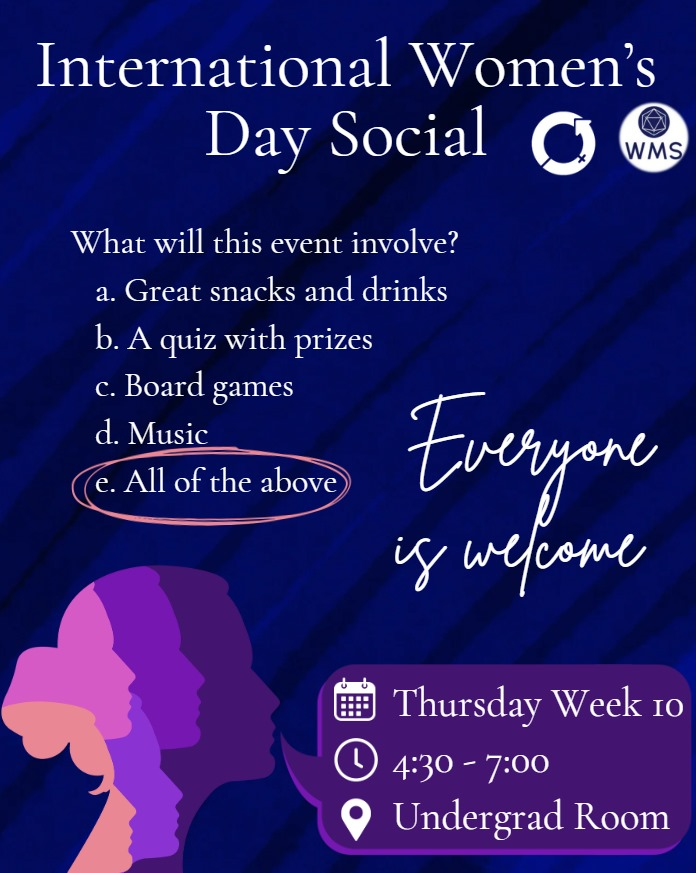

Last Thursday was our **AGM** where we elected our new exec, to take over from next term. The new exec will be:

- **President:** Ingrid Loynes
- **Vice-President:** Carmel West
- **Treasurer:** Zain Lam
- **Welfare and Equal Opportunities Officers:** Charlotte Hegarty and Dori Suntornsuk
- **Social Secretaries:** Kai Getzel and Will Hesslefors
- **Careers Officer:** Zain Lam
- **Talks Coordinators:** Kasim Ahmed and Clara Winne
- **Ball Secretary:** Alex Funnell
- **Marketing Officer:** Carmel West
- **Publications Officers:** Alfie Giffen, with a second position to be filled via by-election at a later date
- **Academic Support Officers:** Roy Rice Guisado and Sean Tan
- **Academic Events Officer:** Joseph Baptist
- **Tour Secretary:** Charlie Bryant
- **Sports Officer:** Amin Batley

---

### Regular Events Schedule

---

On **Wednesday (12th)**, we will be running **Maths Café** in the **UG Workroom** as always, from **1400** to **1600**. As usual, we will be bringing some food for you to enjoy.

If you have any academic questions, our academic support officers (and many other attendees) will be happy to help. Also feel free to ask any questions about LaTeX.

---

The maths department are running a **selection test for the IMC (International Mathematics Competition)**, also on **Wednesday (12th)** from **1400** to **1600**. For more information, see [this page](https://warwick.ac.uk/fac/sci/maths/research/events/seminars/areas/imc/2024-25).

*Note: this event is run and organised by the maths department, and is not affiliated with the Society.*

---

On **Thursday (13th)**, we are running an **International Women's Day-themed social** in the **UG Workroom** from **1630** to **1900**. There will be a quiz, boardgames and, of course, snacks!

See [this post]() for more details.

---

Also on **Thursday (13th)**, we have our regularly scheduled **WMS Talk** titled *Were Navier-Stokes equations designed only for fluids?*, with guest speaker Professor Ewelina Zatorska in **MB0.08** (a **different room than normal**), starting at **1800** until **1900**.

Abstract:
> I will talk about analysis of one of the most famous systems in Mathematical Fluid Mechanics: the Navier-Stokes equations.

> They were originally introduced to model the motion of viscous compressible or incompressible fluid in the first half of the \\(19\\)th century, but to this date the mathematical understanding of this system is incomplete. For example, the existence and smoothness of solutions remains one of unclaimed Millenium Prize Problems of Clay Mathematics Institute.

> I will explain why these equations can be of interest to mathematicians who instead of thinking about the gas atoms prefer to watch the birds...

As always, free pizza will be provided after the talk (suitable for all dietary requirements).

---

On **Friday (14th)**, we are running **Coffee and Cake**, our weekly welfare event, from **1500** to **1600**, in **MB0.07**. Drop in to get a hot drink and some free food, and relax with others in an informal and friendly environment.
