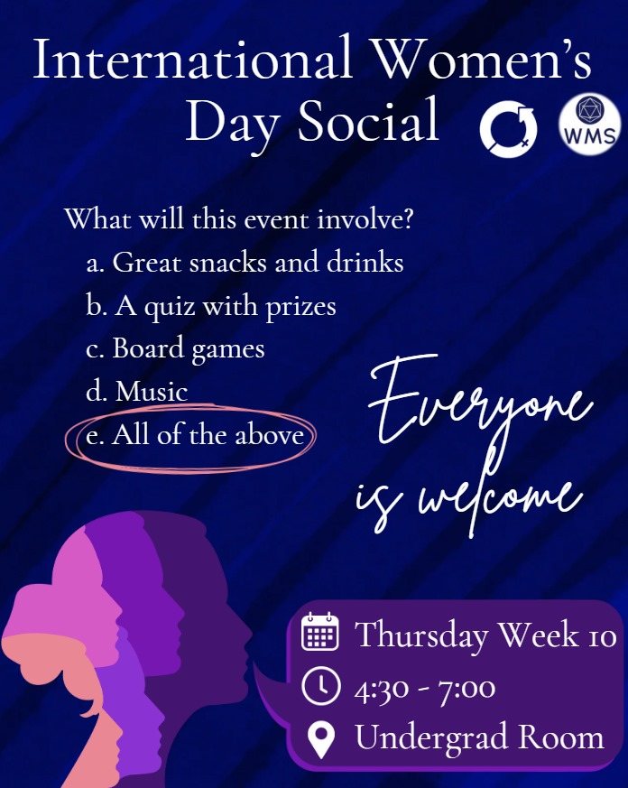

To end the last week of term in a fun and wholesome way, we invite you to the **International Women's Day** themed social, organised by current Welfare Officers Ingrid & Imogen and Freshers' Rep Ekaterina (me, hehe). There will be a quiz, boardgames, and -- of course -- snacks!

We're really looking forward to seeing you all there.

Location: **Undergrad Room**

Time: **Thursday, Week 10; 4:30 - 7:00 PM**

Who should come? **Everyone is welcome!**

## Poster

